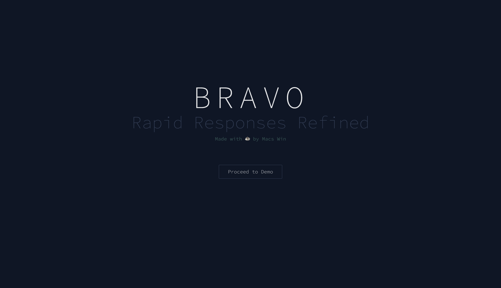
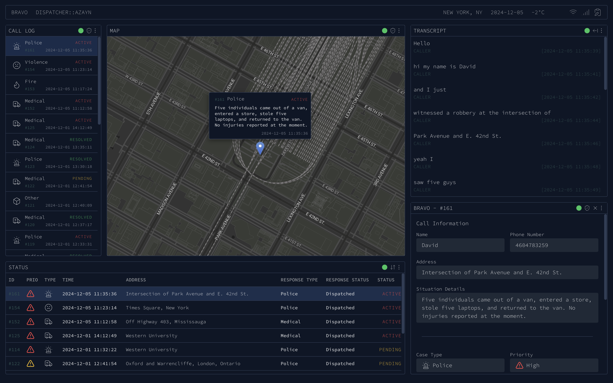
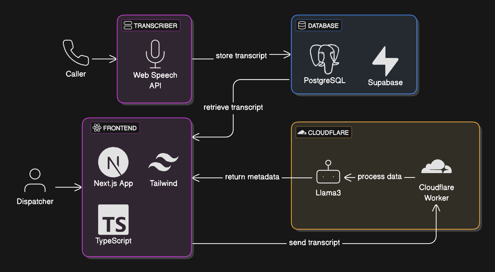

# Inspiration 💡
April 12, 2018 in Cincinnati, Ohio, a failed dispatch mission lead to the death of 16 year-old Kyle Plush. His death was caused by an array of errors, both human and computer, and was completely tragic and preventable. More details on this case are found in the article here.

# Overview 📋
BravoDispatch is a computer-aided dispatcher (CAD) application designed to help dispatch operators better handle calls. Bravo AI extracts critical details from a live caller transcript, and helps manage a set of active cases. It reduces manual data entry, takes some tension off of operators, and improves response times.

# Technical Information 🖥️
BravoDispatch is built on a React framework, using Next.js for the front and backend, and Supabase as the data store. Extracting key information from transcript data is done by making a call to Cloudflare worker, which leverages the Llama 3 LLM.

# Future Outlook 🚀
We made the most of our 36 hours, but looking to the future, this app would incorporate more features. For example, the live transcription module would include more languages and robustness. Then, we would want to use DeX, and also implement address verification. Furthermore, we would add recommended actions based on the category of the call. There could also be more fine-tuning for the AI, and overall maximally reduce any friction between the dispatcher and AI.

# Team composition 🤝
At the time of writing, we are a team of final-year software engineering students from McMaster University. This is probably our last hackathon and it's been a journey and a blast, thanks to all the people at Hack Western that helped make it happen.

[Zayn Abed](https://github.com/abedmohammed)
[Maged Armanios](https://github.com/marmanios)
[Jinal Kasturiarachchi](https://github.com/jinalkast)
[Jane Klavir](https://github.com/jane-klavir)